# Private, Asynchronous Multi‑Region Secret Replication for Azure Key Vault

## Deployment variants

| Variant | Infrastructure | Runtime | Deployment guide |
| --- | --- | --- | --- |
| Private-endpoint-only, managed identity/RBAC | [`infra/main.bicep`](./infra/main.bicep) | [`private-functions/`](./private-functions/) timer polling and private Service Bus | [Bicep deployment README](./infra/README.md) or [Portal deployment guide](./docs/azure-portal-deployment-guide.md) |
| Original Terraform reference | `main.tf` | `replicatefunc/`, Event Grid-driven | Original instructions below |

**For strict private data-plane access, use the Bicep variant.** It disables public access and key authentication, uses identity-authenticated Blob packages instead of Azure Files, enables vault purge protection, and replaces Event Grid delivery with polling. Primary polling is active by default; enable secondary polling only during a controlled failover. Event Grid cannot deliver through private endpoints.

The original Terraform and runtime are retained unchanged for reference; they are not the strict-private implementation and must not be mixed with the new package. No resources have been migrated automatically.

## Private polling architecture

The diagram shows the **Bicep solution**, not the legacy Event Grid design. Azure PaaS services and Function Apps are outside the VNets; the apps use delegated subnet integration for outbound calls through private endpoints. Both workers remain active, but only the primary polling producer starts enabled.

Default template regions are shown; select different regions, such as East US/Central US, through the Bicep parameters.

```mermaid
flowchart TB
    Admin["Existing private build / admin hosts<br/>Upload prebuilt ZIP with Entra RBAC"]

    subgraph Primary["Primary - South Central US"]
        PApp["EP1 Function App + managed identity<br/>Poller ON / worker ON"]
        subgraph PVNet["Primary VNet - separate integration and PE subnets"]
            PAccess["Private endpoint paths - 8<br/>Both vaults + both Service Bus namespaces<br/>Local Blob / Queue / Table + app / SCM"]
            PDNS["6 local private DNS zones"]
        end
        PKV["Primary Key Vault<br/>Secrets + purge protection"]
        PBus["Primary Service Bus Premium<br/>kv-events + dead-letter queue"]
        PStorage["Primary private StorageV2<br/>Package / host / operation state"]
    end

    subgraph Secondary["Secondary - Sweden Central"]
        SApp["EP1 Function App + managed identity<br/>Poller OFF until failover / worker ON"]
        subgraph SVNet["Secondary VNet - separate integration and PE subnets"]
            SAccess["Private endpoint paths - 8<br/>Both vaults + both Service Bus namespaces<br/>Local Blob / Queue / Table + app / SCM"]
            SDNS["6 local private DNS zones"]
        end
        SKV["Secondary Key Vault<br/>Secrets + purge protection"]
        SBus["Secondary Service Bus Premium<br/>kv-events + dead-letter queue"]
        SStorage["Secondary private StorageV2<br/>Package / host / operation state"]
    end

    PApp -->|"Outbound VNet integration"| PAccess
    SApp -->|"Outbound VNet integration"| SAccess
    PDNS -.->|"VNet link"| PAccess
    SDNS -.->|"VNet link"| SAccess
    Admin -->|"Private package upload"| PAccess
    Admin -->|"Private package upload"| SAccess

    PAccess -->|"Poll / local writes"| PKV
    SAccess -->|"Write replica / failover poll"| SKV
    SAccess -->|"Worker reads source version"| PKV
    PAccess -->|"Worker reads remote version"| SKV
    PAccess -->|"Send version references"| SBus
    SAccess -->|"Worker consumes"| SBus
    SAccess -.->|"Failover: send references"| PBus
    PAccess -->|"Worker consumes"| PBus
    PAccess -->|"MI package fetch + state"| PStorage
    SAccess -->|"MI package fetch + state"| SStorage

    classDef app fill:#E8DAEF,stroke:#5C2D91,color:#000;
    classDef endpoint fill:#CFE4FA,stroke:#0078D4,color:#000;
    classDef service fill:#DFF6DD,stroke:#107C10,color:#000;
    class PApp,SApp app;
    class PAccess,SAccess endpoint;
    class PKV,SKV,PBus,SBus,PStorage,SStorage service;
```



**Normal flow:** primary poller reads a local secret version, enqueues its reference in the secondary queue, and the secondary worker reads that source version and writes its local vault. Private Blob operation state prevents replication loops and deduplicates normal retries. The dashed send path is activated only during a controlled failover with the old writer fenced.

**Network boundary:** 16 private endpoints and 12 private DNS zones; no VNet peering, Event Grid delivery, trusted-service bypass, Azure Files, storage keys, or SAS credentials. Public data-plane access is disabled. ARM, operator Entra authentication, and build-feed/control-plane connectivity are not shown and are not made private by this template.

**Architecture source documentation:** [Private endpoint overview](https://learn.microsoft.com/en-us/azure/private-link/private-endpoint-overview), [private DNS configuration](https://learn.microsoft.com/en-us/azure/private-link/private-endpoint-dns), [Functions networking](https://learn.microsoft.com/en-us/azure/azure-functions/functions-networking-options), [Event Grid private delivery limitation](https://learn.microsoft.com/en-us/azure/event-grid/managed-service-identity#private-endpoints), and [GitHub Mermaid rendering](https://docs.github.com/en/get-started/writing-on-github/working-with-advanced-formatting/creating-diagrams).

Full source-reference appendices are included in the [Bicep README](./infra/README.md#appendix---source-documentation) and [Portal guide](./docs/azure-portal-deployment-guide.md#appendix---source-documentation).

## Original Terraform introduction

This Terraform deployment implements a **private, asynchronous, multi‑region secret replication architecture for Azure Key Vault**. The pattern enables organizations to maintain business continuity before a Microsoft‑declared regional outage. It ensures that a secondary region (Sweden Central) always contains an up‑to‑date replica of secrets stored in the primary region (South Central US).

The solution provides:

- Continuous, event‑driven secret replication infrastructure
- Private endpoint and private DNS paths for Key Vault, Storage blob/file, and local Service Bus access
- Region‑agnostic flexibility with cross‑geography replication
- Cross-region private endpoint connectivity for both Key Vaults
- Bi-directional replication capability (South Central US ↔ Sweden Central)

## Prerequisites

- Azure subscription with appropriate permissions
- Terraform >= 1.0
- Azure CLI or appropriate credentials configured
- Terraform AzureRM provider ~> 4.0
- Quota for App Service Plan EP1 in both regions

>[!IMPORTANT]
>Quota for App Service Plan EP1 is set to 0 by default. Request a quota increase for EP1 in both South Central US and Sweden Central regions before deploying. Use support cases with Microsoft and request escalation. The process may take several days, so plan accordingly.


This deployment uses RBAC-based authentication for Function App access to storage accounts. Function Apps use System-Assigned Managed Identities with the following roles:

- **Storage Blob Data Contributor** for blob storage operations
- **Storage File Data SMB Share Contributor** for file share operations
- **Storage Queue Data Contributor** for runtime queue operations

Storage accounts are configured with RBAC authentication only. File shares are created via ARM API (`az storage share-rm create`) and do not require shared key access.

## Deployment Architecture


The workload is Multi-Region Key Vault Replication (MRKV). Regions are identified as Primary and Secondary, consisting of:

### Resource groups

- **Primary**: `rg-mrkv-primary` (South Central US)
- **Secondary**: `rg-mrkv-secondary` (Sweden Central)

### Network infrastructure

#### Primary region (South Central US)

- VNet: `vnet-mrkv-primary` (10.35.0.0/16)
  - `snet-function-primary` (10.35.1.0/24) — Function App subnet with Microsoft.Storage service endpoint
  - `snet-private-endpoints-primary` (10.35.0.0/24) — Private endpoint subnet

#### Secondary region (Sweden Central)

- VNet: `vnet-mrkv-secondary` (10.36.0.0/16)
  - `snet-function-secondary` (10.36.1.0/24) — Function App subnet with Microsoft.Storage service endpoint
  - `snet-private-endpoints-secondary` (10.36.0.0/24) — Private endpoint subnet

### Private DNS zones

Both regions use separate private DNS zones for each domain:

- `privatelink.vaultcore.azure.net`
- `privatelink.servicebus.windows.net`
- `privatelink.blob.core.windows.net`
- `privatelink.file.core.windows.net`

Key Vault DNS uses manual A records so each VNet resolves vault names to the private endpoint IPs reachable from that region. Service Bus and Storage private endpoints use private DNS zone groups for registration.

### Key vaults

Both regions use Standard SKU vaults with RBAC authorization enabled:

- **Primary**: `kv-mrkv-primary` (South Central US)
- **Secondary**: `kv-mrkv-secondary` (Sweden Central)

Both have private endpoints in both regions and purge protection disabled.

> [!WARNING]
> The current Terraform keeps Key Vault purge protection disabled for faster iteration. Azure best practice for production is to enable purge protection and validate your recovery process before go-live.

### Private endpoints (cross-region connectivity)

The deployment creates 10 private endpoints across both regions:

| Region | Resource | Private Endpoint |
| -------- | ---------- | ------------------ |
| Primary | Key Vault primary | `pe-kv-primary` |
| Primary | Key Vault secondary (cross-region) | `pe-kv-secondary-remote` |
| Primary | Service Bus | `pe-sb-primary` |
| Primary | Storage (blob) | `pe-stmrkv-primary-blob` |
| Primary | Storage (file) | `pe-stmrkv-primary-file` |
| Secondary | Key Vault secondary | `pe-kv-secondary` |
| Secondary | Key Vault primary (cross-region) | `pe-kv-primary-remote` |
| Secondary | Service Bus | `pe-sb-secondary` |
| Secondary | Storage (blob) | `pe-stmrkv-secondary-blob` |
| Secondary | Storage (file) | `pe-stmrkv-secondary-file` |

> [!NOTE]
> Manual A records are used only for Key Vault DNS. Service Bus and Storage private endpoints register through private DNS zone groups. The design avoids VNet peering for DNS resolution, but public endpoints still remain enabled on several services for deployment and runtime compatibility.

### Service Bus namespaces

Both regions use Premium SKU with one messaging partition:

- **Primary**: `sb-mrkv-primary` with public network access enabled
- **Secondary**: `sb-mrkv-secondary` with public network access enabled

Each has a private endpoint in its local region.

### Event Grid and Service Bus queues

Event Grid System Topics capture Key Vault events:

- **Primary**: `evgt-kv-mrkv-primary` (South Central US)
- **Secondary**: `evgt-kv-mrkv-secondary` (Sweden Central)

Each routes events to a queue named `kv-events` with partitioning disabled. Event subscriptions route events from system topics to Service Bus queues, triggering the Functions.

### Azure Functions

Both Function Apps use Linux with Python 3.11 and Elastic Premium (EP1) plans with managed identities:

- **Primary**: `func-mrkv-primary` with storage `samrkvprimaryfunc`
- **Secondary**: `func-mrkv-secondary` with storage `samrkvsecondaryfunc`

Both are VNet integrated and use managed identity authentication for all services. All traffic routes through their VNets with `vnet_route_all_enabled` set.

Core app settings:

- Service Bus connection using managed identity
- Storage configured with managed identity
- Key Vault URIs for both regions
- Run From Package enabled

### Managed identities and access control

All Functions use System-Assigned Managed Identities automatically created with the Function App. Each identity receives RBAC role assignments across Key Vaults, Service Bus, and storage accounts.

The primary Function has:

- Writer access to the primary Key Vault
- Writer access to the secondary Key Vault (for replication)
- Read/write access to storage in its local region
- Sender/receiver permissions on both Service Bus namespaces

The secondary Function is configured symmetrically and also has `Key Vault Secrets Officer` on both vaults plus sender/receiver permissions on both Service Bus namespaces.

> [!NOTE]
> The current Function app settings bind each Function to its local Service Bus namespace. Cross-namespace Service Bus RBAC is provisioned in Terraform, but the current app configuration uses the local `ServiceBusConnection__fullyQualifiedNamespace` value in each region.
> [!NOTE]
> This deployment uses only managed identity authentication. No shared keys or connection strings are stored as credentials.

## Messaging and Event Triggering

### Event flow architecture

The solution implements an event-driven pattern that prefers private endpoints for the application data path while leaving some public endpoints enabled for deployment and compatibility:

```text
┌─────────────────────────────────────────────────────────────┐
│ PRIMARY REGION (South Central US)                           │
├─────────────────────────────────────────────────────────────┤
│                                                             │
│  Secret Created/Updated in Key Vault                        │
│  │                                                          │
│  ├──→ Event Grid System Topic (internal)                    │
│  │                                                          │
│  └──→ Event Subscription                                    │
│       │                                                     │
│       └──→ Service Bus Queue: kv-events                     │
│            │                                                │
│            ├──→ Function App triggered                      │
│            │    ├─ Read secret from primary vault           │
│            │    └─ Write to secondary vault                 │
│            │                                                │
│            └──→ Secondary region via private endpoint       │
│                                                             │
└─────────────────────────────────────────────────────────────┘
         │
         │ (Private connectivity)
         │
         ↓
┌─────────────────────────────────────────────────────────────┐
│ SECONDARY REGION (Sweden Central)                           │
├─────────────────────────────────────────────────────────────┤
│                                                             │
│  Secret written to Key Vault (replicated)                   │
│                                                             │
│  (Optional) Replicate back to primary on update             │
│                                                             │
└─────────────────────────────────────────────────────────────┘
```

### Event types and triggers

The Event Grid System Topics capture and route the following Key Vault events:

| Event Type | Trigger | Replication Action |
| --- | --- | --- |
| **SecretNewVersionCreated** | New secret version created or secret updated | Replicate to secondary vault immediately |
| **SecretNearExpiry** | Secret expiring within 30 days | Logged by the Function; no alerting or rotation workflow is provisioned |
| **SecretExpired** | Secret has expired | Logged by the Function; no automated recovery workflow is provisioned |

Each event flows through the Event Subscription to the Service Bus queue, where the Function App processes it as a trigger.

### Service Bus queue processing

**Queue Name**: `kv-events`

**Configuration**:

- **Partitioning**: Disabled
- **Access**: Private endpoints are provisioned, but namespace public network access remains enabled in Terraform
- **Trigger**: Azure Functions Service Bus Trigger

**Message Flow**:

1. Event Grid receives Key Vault event
2. Event Subscription routes to Service Bus queue
3. Queue message delivered via private connection
4. Service Bus Trigger activates Function App
5. Function processes message and replicates secret

### Replication workflow

**Primary Function Replication** (`func-mrkv-primary`):

1. **Trigger**: Service Bus message from `kv-events` queue in primary namespace
2. **Read**: Retrieve secret from `kv-mrkv-primary` using private endpoint
3. **Identify**: Determine if new version or expiry event
4. **Replicate**: Write secret to `kv-mrkv-secondary` using private endpoint
5. **Log**: Record replication status in Function App logs
6. **Acknowledge**: Remove message from Service Bus queue

**Secondary Function Replication** (`func-mrkv-secondary`):

1. **Trigger**: Service Bus message from `kv-events` queue in secondary namespace (when deployed)
2. **Read**: Retrieve secret from `kv-mrkv-secondary`
3. **Replicate**: Write back to `kv-mrkv-primary` for fail-back scenario
4. **Acknowledge**: Process message completion

### Fail-back and bi-directional replication

The secondary region's Function App enables fail-back replication:

- **Scenario**: Primary region is degraded or offline
- **Action**: Updates to secondary Key Vault replicate back to primary
- **Benefit**: Maintains secret synchronization if primary recovers
- **Implementation**: Identical Service Bus queue and Function setup in secondary region

### Dead-letter queue handling

Service Bus dead-letter queues handle failed replication:

- **Trigger**: Function unable to process message after max retries
- **Location**: `kv-events/$DeadLetterQueue` in each namespace
- **Monitoring**: Monitor dead-letter queue for replication errors; Terraform does not create alerts or dashboards for this automatically
- **Manual Retry**: Process dead-lettered messages once root cause is resolved

## Deployment Instructions

### Initialize Terraform

```powershell
terraform init
```

### Review deployment plan

```powershell
terraform plan -out=tfplan
```

### Apply configuration

```powershell
terraform apply tfplan
```

### Verify deployment

```powershell
terraform show
```

### Deploy Function code

The infrastructure creates the hosting resources, identity, RBAC, networking, and bindings. This final step is required because the Python package is not deployed by Terraform. The function code is in `replicatefunc/`, and the Service Bus trigger is defined in `replicatefunc/function.json`.

### Deploy Function code (Azure CLI) in PowerShell

Run from the repo root.

**Package the function app**:

```powershell
Compress-Archive -Path host.json,requirements.txt,replicatefunc -DestinationPath functionapp.zip -Force
```

**Deploy to primary region**:

```powershell
az functionapp deployment source config-zip `
  --resource-group rg-mrkv-primary `
  --name func-mrkv-primary `
  --src functionapp.zip `
  --build-remote true

az functionapp restart `
  --resource-group rg-mrkv-primary `
  --name func-mrkv-primary
```

**Verify deployment**:

```powershell
az functionapp function list --resource-group rg-mrkv-primary --name func-mrkv-primary --query "[].name"
```

If zip deployment fails with a 503 error, temporarily enable `public_network_access_enabled = true` for the deployment, then re-apply your security configuration afterward.

### Deploy Function code to secondary region

Deploy the same function code to the secondary region:

**Deploy to secondary region**:

```powershell
az functionapp deployment source config-zip `
  --resource-group rg-mrkv-secondary `
  --name func-mrkv-secondary `
  --src functionapp.zip `
  --build-remote true

az functionapp restart `
  --resource-group rg-mrkv-secondary `
  --name func-mrkv-secondary
```

**Verify deployment**:

```powershell
az functionapp function list --resource-group rg-mrkv-secondary --name func-mrkv-secondary --query "[].name"
```

Both functions are now deployed and ready to handle cross-region replication.

Terraform already creates the Event Grid System Topics, Event Grid subscriptions, and Service Bus queues. After code deployment, validate that these resources exist and that the Function package is processing messages.

### Verify file share creation

The Terraform uses `az storage share-rm create` through `null_resource` to create the Function file shares. Verify that both shares exist:

```powershell
az storage share-rm show `
  --storage-account samrkvprimaryfunc `
  --resource-group rg-mrkv-primary `
  --name func-mrkv-primary-share `
  --output table

az storage share-rm show `
  --storage-account samrkvsecondaryfunc `
  --resource-group rg-mrkv-secondary `
  --name func-mrkv-secondary-share `
  --output table
```

## MRKV Workload Verification

### Verify end-to-end replication [bash]

#### Primary to secondary

Update the secret in primary and verify it propagates to secondary:

```bash
# Update primary secret
az keyvault secret set \
  --vault-name kv-mrkv-primary \
  --name test-p2s \
  --value "updated-value-$(date +%s)"

# Wait for replication
sleep 10

# Verify update in secondary
az keyvault secret show \
  --vault-name kv-mrkv-secondary \
  --name test-p2s \
  --query "value" \
  --output tsv
```

#### Secondary to primary

Update the secret in secondary and verify it propagates back to primary:

```bash
# Update secondary secret
az keyvault secret set \
  --vault-name kv-mrkv-secondary \
  --name test-s2p \
  --value "updated-value-$(date +%s)"

# Wait for replication
sleep 10

# Verify update in primary
az keyvault secret show \
  --vault-name kv-mrkv-primary \
  --name test-s2p \
  --query "value" \
  --output tsv
```

## Troubleshooting and Validation

### Verify Function App configuration [bash]

These settings were needed during deployment so the Functions could start correctly after code deployment and authenticate without secrets.

#### Primary Function App

```bash
az functionapp config appsettings list \
  --resource-group rg-mrkv-primary \
  --name func-mrkv-primary \
  --query "[?name=='PRIMARY_KEY_VAULT_URI' || name=='SECONDARY_KEY_VAULT_URI' || name=='PRIMARY_KEY_VAULT_NAME' || name=='SECONDARY_KEY_VAULT_NAME' || name=='ServiceBusConnection__fullyQualifiedNamespace' || name=='ServiceBusConnection__credential' || name=='AzureWebJobsStorage__accountName' || name=='AzureWebJobsStorage__credential' || name=='FUNCTIONS_WORKER_RUNTIME' || name=='WEBSITE_RUN_FROM_PACKAGE'].{name:name,value:value}" \
  --output table

az functionapp show \
  --resource-group rg-mrkv-primary \
  --name func-mrkv-primary \
  --query "{subnet:virtualNetworkSubnetId,state:state,hostNames:enabledHostNames}" \
  --output json
```

#### Secondary Function App

```bash
az functionapp config appsettings list \
  --resource-group rg-mrkv-secondary \
  --name func-mrkv-secondary \
  --query "[?name=='PRIMARY_KEY_VAULT_URI' || name=='SECONDARY_KEY_VAULT_URI' || name=='PRIMARY_KEY_VAULT_NAME' || name=='SECONDARY_KEY_VAULT_NAME' || name=='ServiceBusConnection__fullyQualifiedNamespace' || name=='ServiceBusConnection__credential' || name=='AzureWebJobsStorage__accountName' || name=='AzureWebJobsStorage__credential' || name=='FUNCTIONS_WORKER_RUNTIME' || name=='WEBSITE_RUN_FROM_PACKAGE'].{name:name,value:value}" \
  --output table

az functionapp show \
  --resource-group rg-mrkv-secondary \
  --name func-mrkv-secondary \
  --query "{subnet:virtualNetworkSubnetId,state:state,hostNames:enabledHostNames}" \
  --output json
```

### Verify Function App public network access [bash]

This setting was needed during deployment because zip deploy uses the Function App SCM endpoint.

#### Primary Function App network access

```bash
az functionapp show \
  --resource-group rg-mrkv-primary \
  --name func-mrkv-primary \
  --query "{publicNetworkAccess:publicNetworkAccess, httpsOnly:httpsOnly}" \
  --output table
```

#### Secondary Function App network access

```bash
az functionapp show \
  --resource-group rg-mrkv-secondary \
  --name func-mrkv-secondary \
  --query "{publicNetworkAccess:publicNetworkAccess, httpsOnly:httpsOnly}" \
  --output table
```

### Verify storage RBAC configuration [bash]

This setting was needed during deployment because shared key access is disabled by policy and the Functions must use RBAC instead.

> [!NOTE]
> If RBAC verification returns no rows, wait 2 to 10 minutes for propagation and retry. Also confirm your signed-in identity has permission to read role assignments at the target scope (for example, Reader plus role-assignment read permissions).
> The commands below use `az rest` against the ARM roleAssignments endpoint. This avoids Azure CLI argument/version differences and the intermittent `az role assignment list` `Bad Request` behavior.
> The example queries below focus on the blob and file roles required for the Function storage path. Terraform also assigns `Storage Queue Data Contributor` to both Function identities.
> Expected role IDs in the output: `ba92f5b4-2d11-453d-a403-e96b0029c9fe` = Storage Blob Data Contributor, `0c867c2a-1d8c-454a-a3db-ab2ea1bdc8bb` = Storage File Data SMB Share Contributor.

#### Primary storage account RBAC

```bash
PRIMARY_FUNC_PRINCIPAL_ID=$(az functionapp identity show \
  --resource-group rg-mrkv-primary \
  --name func-mrkv-primary \
  --query principalId -o tsv | tr -d '\r')

PRIMARY_STORAGE_ID=$(az storage account show \
  --resource-group rg-mrkv-primary \
  --name samrkvprimaryfunc \
  --query id -o tsv | tr -d '\r')

PRIMARY_ROLE_ASSIGNMENTS_URL="https://management.azure.com${PRIMARY_STORAGE_ID}/providers/Microsoft.Authorization/roleAssignments?api-version=2022-04-01"

az rest \
  --method get \
  --url "$PRIMARY_ROLE_ASSIGNMENTS_URL" \
  --query "value[?properties.principalId=='$PRIMARY_FUNC_PRINCIPAL_ID' && (contains(properties.roleDefinitionId, 'ba92f5b4-2d11-453d-a403-e96b0029c9fe') || contains(properties.roleDefinitionId, '0c867c2a-1d8c-454a-a3db-ab2ea1bdc8bb'))].{principalId:properties.principalId,roleDefinitionId:properties.roleDefinitionId,scope:properties.scope}" \
  --output table
```

#### Secondary storage account RBAC

```bash
SECONDARY_FUNC_PRINCIPAL_ID=$(az functionapp identity show \
  --resource-group rg-mrkv-secondary \
  --name func-mrkv-secondary \
  --query principalId -o tsv | tr -d '\r')

SECONDARY_STORAGE_ID=$(az storage account show \
  --resource-group rg-mrkv-secondary \
  --name samrkvsecondaryfunc \
  --query id -o tsv | tr -d '\r')

SECONDARY_ROLE_ASSIGNMENTS_URL="https://management.azure.com${SECONDARY_STORAGE_ID}/providers/Microsoft.Authorization/roleAssignments?api-version=2022-04-01"

az rest \
  --method get \
  --url "$SECONDARY_ROLE_ASSIGNMENTS_URL" \
  --query "value[?properties.principalId=='$SECONDARY_FUNC_PRINCIPAL_ID' && (contains(properties.roleDefinitionId, 'ba92f5b4-2d11-453d-a403-e96b0029c9fe') || contains(properties.roleDefinitionId, '0c867c2a-1d8c-454a-a3db-ab2ea1bdc8bb'))].{principalId:properties.principalId,roleDefinitionId:properties.roleDefinitionId,scope:properties.scope}" \
  --output table
```

### Verify storage account public network access [bash]

This setting remains enabled in the current Terraform because it avoids deployment and platform issues while private endpoints still provide the intended private data path.

#### Primary storage account network access

```bash
az storage account show \
  --resource-group rg-mrkv-primary \
  --name samrkvprimaryfunc \
  --query "{publicNetworkAccess:publicNetworkAccess, defaultAction:networkRuleSet.defaultAction, allowSharedKeyAccess:allowSharedKeyAccess}" \
  --output table
```

#### Secondary storage account network access

```bash
az storage account show \
  --resource-group rg-mrkv-secondary \
  --name samrkvsecondaryfunc \
  --query "{publicNetworkAccess:publicNetworkAccess, defaultAction:networkRuleSet.defaultAction, allowSharedKeyAccess:allowSharedKeyAccess}" \
  --output table
```

### Verify Key Vault RBAC assignments [bash]

These assignments were needed during deployment so the Functions could read and write secrets across both regions once the code was deployed.

#### Primary Function identity against both vaults

```bash
PRIMARY_FUNC_PRINCIPAL_ID=$(az functionapp identity show \
  --resource-group rg-mrkv-primary \
  --name func-mrkv-primary \
  --query principalId -o tsv | tr -d '\r')

PRIMARY_VAULT_ID=$(az keyvault show \
  --resource-group rg-mrkv-primary \
  --name kv-mrkv-primary \
  --query id -o tsv | tr -d '\r')

SECONDARY_VAULT_ID=$(az keyvault show \
  --resource-group rg-mrkv-secondary \
  --name kv-mrkv-secondary \
  --query id -o tsv | tr -d '\r')

PRIMARY_VAULT_ROLE_ASSIGNMENTS_URL="https://management.azure.com${PRIMARY_VAULT_ID}/providers/Microsoft.Authorization/roleAssignments?api-version=2022-04-01"
SECONDARY_VAULT_ROLE_ASSIGNMENTS_URL="https://management.azure.com${SECONDARY_VAULT_ID}/providers/Microsoft.Authorization/roleAssignments?api-version=2022-04-01"

az rest \
  --method get \
  --url "$PRIMARY_VAULT_ROLE_ASSIGNMENTS_URL" \
  --query "value[?properties.principalId=='$PRIMARY_FUNC_PRINCIPAL_ID'].{principalId:properties.principalId,roleDefinitionId:properties.roleDefinitionId,scope:properties.scope}" \
  --output table

az rest \
  --method get \
  --url "$SECONDARY_VAULT_ROLE_ASSIGNMENTS_URL" \
  --query "value[?properties.principalId=='$PRIMARY_FUNC_PRINCIPAL_ID'].{principalId:properties.principalId,roleDefinitionId:properties.roleDefinitionId,scope:properties.scope}" \
  --output table
```

#### Secondary Function identity against both vaults

```bash
SECONDARY_FUNC_PRINCIPAL_ID=$(az functionapp identity show \
  --resource-group rg-mrkv-secondary \
  --name func-mrkv-secondary \
  --query principalId -o tsv | tr -d '\r')

PRIMARY_VAULT_ID=$(az keyvault show \
  --resource-group rg-mrkv-primary \
  --name kv-mrkv-primary \
  --query id -o tsv | tr -d '\r')

SECONDARY_VAULT_ID=$(az keyvault show \
  --resource-group rg-mrkv-secondary \
  --name kv-mrkv-secondary \
  --query id -o tsv | tr -d '\r')

PRIMARY_VAULT_ROLE_ASSIGNMENTS_URL="https://management.azure.com${PRIMARY_VAULT_ID}/providers/Microsoft.Authorization/roleAssignments?api-version=2022-04-01"
SECONDARY_VAULT_ROLE_ASSIGNMENTS_URL="https://management.azure.com${SECONDARY_VAULT_ID}/providers/Microsoft.Authorization/roleAssignments?api-version=2022-04-01"

az rest \
  --method get \
  --url "$PRIMARY_VAULT_ROLE_ASSIGNMENTS_URL" \
  --query "value[?properties.principalId=='$SECONDARY_FUNC_PRINCIPAL_ID'].{principalId:properties.principalId,roleDefinitionId:properties.roleDefinitionId,scope:properties.scope}" \
  --output table

az rest \
  --method get \
  --url "$SECONDARY_VAULT_ROLE_ASSIGNMENTS_URL" \
  --query "value[?properties.principalId=='$SECONDARY_FUNC_PRINCIPAL_ID'].{principalId:properties.principalId,roleDefinitionId:properties.roleDefinitionId,scope:properties.scope}" \
  --output table
```

### Verify Key Vault private access path [bash]

This is the network dependency that mattered during deployment and runtime. The Functions rely on private endpoints and private DNS to reach both vaults over private IPs.

#### Primary region private endpoints

```bash
az network private-endpoint list \
  --resource-group rg-mrkv-primary \
  --query "[?contains(name, 'pe-kv')].{name:name,service:privateLinkServiceConnections[0].privateLinkServiceId,ip:customDnsConfigs[0].ipAddresses[0]}" \
  --output table
```

#### Secondary region private endpoints

```bash
az network private-endpoint list \
  --resource-group rg-mrkv-secondary \
  --query "[?contains(name, 'pe-kv')].{name:name,service:privateLinkServiceConnections[0].privateLinkServiceId,ip:customDnsConfigs[0].ipAddresses[0]}" \
  --output table
```

#### Key Vault private DNS A records

```bash
az network private-dns record-set a list \
  --resource-group rg-mrkv-primary \
  --zone-name privatelink.vaultcore.azure.net \
  --query "[].{name:name,ips:arecords[].ipv4Address}" \
  --output table

az network private-dns record-set a list \
  --resource-group rg-mrkv-secondary \
  --zone-name privatelink.vaultcore.azure.net \
  --query "[].{name:name,ips:arecords[].ipv4Address}" \
  --output table
```

### Verify Service Bus public network access [bash]

This setting remains enabled in the current Terraform. The deployment uses private endpoints for the VNet path, while keeping the namespace reachable for platform operations and avoiding setup issues.

#### Primary Service Bus namespace network access

```bash
az servicebus namespace show \
  --resource-group rg-mrkv-primary \
  --name sb-mrkv-primary \
  --query "{publicNetworkAccess:publicNetworkAccess, sku:sku.name, capacity:sku.capacity, premiumPartitions:premiumMessagingPartitions}" \
  --output table
```

#### Secondary Service Bus namespace network access

```bash
az servicebus namespace show \
  --resource-group rg-mrkv-secondary \
  --name sb-mrkv-secondary \
  --query "{publicNetworkAccess:publicNetworkAccess, sku:sku.name, capacity:sku.capacity, premiumPartitions:premiumMessagingPartitions}" \
  --output table
```

### Verify Service Bus RBAC assignments [bash]

These assignments were needed during deployment so the Functions could receive and complete queue-triggered messages in both regions.

#### Primary Function identity against both namespaces

```bash
PRIMARY_FUNC_PRINCIPAL_ID=$(az functionapp identity show \
  --resource-group rg-mrkv-primary \
  --name func-mrkv-primary \
  --query principalId -o tsv | tr -d '\r')

PRIMARY_SB_ID=$(az servicebus namespace show \
  --resource-group rg-mrkv-primary \
  --name sb-mrkv-primary \
  --query id -o tsv | tr -d '\r')

SECONDARY_SB_ID=$(az servicebus namespace show \
  --resource-group rg-mrkv-secondary \
  --name sb-mrkv-secondary \
  --query id -o tsv | tr -d '\r')

PRIMARY_SB_ROLE_ASSIGNMENTS_URL="https://management.azure.com${PRIMARY_SB_ID}/providers/Microsoft.Authorization/roleAssignments?api-version=2022-04-01"
SECONDARY_SB_ROLE_ASSIGNMENTS_URL="https://management.azure.com${SECONDARY_SB_ID}/providers/Microsoft.Authorization/roleAssignments?api-version=2022-04-01"

az rest \
  --method get \
  --url "$PRIMARY_SB_ROLE_ASSIGNMENTS_URL" \
  --query "value[?properties.principalId=='$PRIMARY_FUNC_PRINCIPAL_ID'].{principalId:properties.principalId,roleDefinitionId:properties.roleDefinitionId,scope:properties.scope}" \
  --output table

az rest \
  --method get \
  --url "$SECONDARY_SB_ROLE_ASSIGNMENTS_URL" \
  --query "value[?properties.principalId=='$PRIMARY_FUNC_PRINCIPAL_ID'].{principalId:properties.principalId,roleDefinitionId:properties.roleDefinitionId,scope:properties.scope}" \
  --output table
```

#### Secondary Function identity against both namespaces

```bash
SECONDARY_FUNC_PRINCIPAL_ID=$(az functionapp identity show \
  --resource-group rg-mrkv-secondary \
  --name func-mrkv-secondary \
  --query principalId -o tsv | tr -d '\r')

PRIMARY_SB_ID=$(az servicebus namespace show \
  --resource-group rg-mrkv-primary \
  --name sb-mrkv-primary \
  --query id -o tsv | tr -d '\r')

SECONDARY_SB_ID=$(az servicebus namespace show \
  --resource-group rg-mrkv-secondary \
  --name sb-mrkv-secondary \
  --query id -o tsv | tr -d '\r')

PRIMARY_SB_ROLE_ASSIGNMENTS_URL="https://management.azure.com${PRIMARY_SB_ID}/providers/Microsoft.Authorization/roleAssignments?api-version=2022-04-01"
SECONDARY_SB_ROLE_ASSIGNMENTS_URL="https://management.azure.com${SECONDARY_SB_ID}/providers/Microsoft.Authorization/roleAssignments?api-version=2022-04-01"

az rest \
  --method get \
  --url "$PRIMARY_SB_ROLE_ASSIGNMENTS_URL" \
  --query "value[?properties.principalId=='$SECONDARY_FUNC_PRINCIPAL_ID'].{principalId:properties.principalId,roleDefinitionId:properties.roleDefinitionId,scope:properties.scope}" \
  --output table

az rest \
  --method get \
  --url "$SECONDARY_SB_ROLE_ASSIGNMENTS_URL" \
  --query "value[?properties.principalId=='$SECONDARY_FUNC_PRINCIPAL_ID'].{principalId:properties.principalId,roleDefinitionId:properties.roleDefinitionId,scope:properties.scope}" \
  --output table
```

## Post-Deployment Configuration

After deploying the infrastructure, verify the settings that the deployment depends on.

### Why these settings matter

The deployment uses private endpoints for data-plane access, but several platform settings must still be present for provisioning, code deployment, or runtime startup:

1. **Function App configuration** is required so each Function can start with the correct Key Vault URIs, authenticate to Service Bus with managed identity, and use AzureWebJobsStorage without storage keys.
2. **Function App public network access** is intentionally enabled in this Terraform because zip deployment uses the SCM/Kudu endpoint. Without it, `az functionapp deployment source config-zip` can fail.
3. **Storage RBAC configuration** is required because shared key access is blocked by policy. The Function runtime and the manual file-share creation flow both depend on Microsoft Entra ID and RBAC.
4. **Storage account public network access** remains enabled in this deployment to avoid platform and provisioning issues during deployment. Data-plane access for the app still uses private endpoints and private DNS.
5. **Key Vault RBAC assignments** are required because both Functions must read from one vault and write to the other during replication.
6. **Key Vault network path** matters because the app is designed to reach both vaults over private endpoints from each region. This is what preserves private east-west traffic during replication.
7. **Service Bus public network access** remains enabled in this deployment. The Function binds through managed identity, while private endpoints provide the private path from the VNets. Keeping public network access enabled also avoids breaking Service Bus namespace operations during setup.
8. **Function code deployment** is still a required post-deployment step. The infrastructure creates the hosting environment, but replication does not start until the Python package is deployed with remote build enabled.

### Hardening notes

The current Terraform favors easier deployment over full network lockdown. Before production, validate these tradeoffs and harden where appropriate:

1. **Enable Key Vault purge protection** and validate your recovery process.
2. **Review public network access** on Function Apps, Service Bus namespaces, storage accounts, and Key Vaults after confirming your private path and deployment workflow.
3. **Add Storage queue private endpoints and DNS** before disabling storage public network access. The current Terraform creates private endpoints for blob and file, but not queue.
4. **Reduce symmetric RBAC** if you want a stricter primary/secondary separation. The current Terraform grants both Functions write access to both vaults and sender/receiver rights on both namespaces.

## Testing

Use these commands to verify replication is working in both directions. Run them from WSL or a bash shell.

### Testing Prerequisites

The Key Vaults use RBAC-only authorization. Grant your CLI identity the `Key Vault Secrets Officer` role on both vaults before testing:

```bash
# Get your current user's object ID
USER_OBJECT_ID=$(az ad signed-in-user show --query id --output tsv)

# Primary vault
az role assignment create \
  --role "Key Vault Secrets Officer" \
  --assignee "$USER_OBJECT_ID" \
  --scope $(az keyvault show --name kv-mrkv-primary --resource-group rg-mrkv-primary --query id --output tsv)

# Secondary vault
az role assignment create \
  --role "Key Vault Secrets Officer" \
  --assignee "$USER_OBJECT_ID" \
  --scope $(az keyvault show --name kv-mrkv-secondary --resource-group rg-mrkv-secondary --query id --output tsv)
```

> [!NOTE]
> Role assignments can take 1–2 minutes to propagate. If you receive a 403 Forbidden error, wait and retry.
> [!WARNING]
> **Replication loop**: Both Function Apps replicate any `SecretNewVersionCreated` event. Updates to the primary vault trigger replication to secondary, which then triggers replication back to primary. This is expected for bi-directional sync but causes repeated queue messages. Use distinct secret names for each test direction (e.g., `test-p2s`, `test-s2p`) to observe each direction independently.
> [!NOTE]
> `SecretNearExpiry` and `SecretExpired` events are routed to Service Bus by Terraform, but the current Function code only logs those events. No alerting, notification, or automated rotation workflow is included in this repo.

### Check Service Bus queue status

Monitor the Service Bus queues to ensure messages are being processed:

```bash
# Primary Service Bus queue
az servicebus queue show \
  --namespace-name sb-mrkv-primary \
  --resource-group rg-mrkv-primary \
  --name kv-events \
  --query "{active:countDetails.activeMessageCount, deadLetter:countDetails.deadLetterMessageCount}"

# Secondary Service Bus queue
az servicebus queue show \
  --namespace-name sb-mrkv-secondary \
  --resource-group rg-mrkv-secondary \
  --name kv-events \
  --query "{active:countDetails.activeMessageCount, deadLetter:countDetails.deadLetterMessageCount}"
```

If `active` is 0, messages are being processed successfully. If > 0, check Function App logs with `az webapp log tail` for processing errors.

### Check dead-letter queue

If replication is not working, check the dead-letter queue for failed messages:

```bash
# Primary dead-letter queue
az servicebus queue show \
  --namespace-name sb-mrkv-primary \
  --resource-group rg-mrkv-primary \
  --name "kv-events/$DeadLetterQueue"

# Secondary dead-letter queue
az servicebus queue show \
  --namespace-name sb-mrkv-secondary \
  --resource-group rg-mrkv-secondary \
  --name "kv-events/$DeadLetterQueue"
```

Dead-lettered messages indicate replication failures that require investigation.

## Operational workflow

### Normal operation (forward replication)

1. Secret created/updated in primary Key Vault (`kv-mrkv-primary`)
2. Event Grid System Topic emits event
3. Event routed to Service Bus queue (`sb-mrkv-primary`)
4. Function (`func-mrkv-primary`) triggered by queue message
5. Function reads secret from primary vault via private endpoint
6. Function writes secret to secondary vault (`kv-mrkv-secondary`) via private endpoint

### Fail-back operation (reverse replication)

1. Secret created/updated in secondary Key Vault (`kv-mrkv-secondary`)
2. Event Grid System Topic emits event (`evgt-kv-mrkv-secondary`)
3. Event routed to Service Bus queue (`sb-mrkv-secondary`)
4. Function (`func-mrkv-secondary`) triggered
5. Function replicates to primary vault via cross-region private endpoint

### Regional degradation scenarios

#### South Central US Degradation

- Sweden Central remains current as long as primary region can emit events
- Applications can fail over to secondary vault
- Cross-region private endpoints enable continued access

#### Sweden Central Degradation

- Primary region continues normal operations
- Replication may be delayed but will resume when secondary recovers
- Dead-letter queues capture failed replication attempts

#### Full Regional Outage

- If primary region experiences complete outage, Sweden Central vault remains available
- Applications can be redirected to use secondary vault
- Upon recovery, fail-back replication syncs Sweden → South Central US

## Resource Naming Conventions

This deployment follows a consistent naming pattern:

| Resource Type | Primary Name | Secondary Name |
| -------------- | -------------- | ---------------- |
| Resource Group | `rg-mrkv-primary` | `rg-mrkv-secondary` |
| Virtual Network | `vnet-mrkv-primary` | `vnet-mrkv-secondary` |
| Key Vault | `kv-mrkv-primary` | `kv-mrkv-secondary` |
| Service Bus | `sb-mrkv-primary` | `sb-mrkv-secondary` |
| Event Grid System Topic | `evgt-kv-mrkv-primary` | `evgt-kv-mrkv-secondary` |
| Function App | `func-mrkv-primary` | `func-mrkv-secondary` |
| Storage Account | `samrkvprimaryfunc` | `samrkvsecondaryfunc` |
| App Service Plan | `asp-mrkv-primary` | `asp-mrkv-secondary` |

## Monitoring and health

### Key metrics to track

- **Replication Lag**: Time between secret update and replication completion
- **Function Execution**: Success/failure rates, duration, exceptions
- **Service Bus**: Queue depth, dead-letter queue messages
- **Key Vault**: Request latency, throttling events, availability
- **Private Endpoints**: Connection status, DNS resolution times

### Recommended monitoring tools

- Azure Monitor for metrics and logs
- Application Insights for Function telemetry (optional; not provisioned by this Terraform configuration)
- Log Analytics for centralized log queries
- Azure Service Health for regional status

## Security and compliance

### Security features

- **Private connectivity for core data paths**: Private endpoints are provisioned for Key Vault, Service Bus, and storage blob/file services
- **Network isolation where configured**: Key Vault DNS uses manual A records and Service Bus/Storage use private DNS zone groups, while some public endpoints remain enabled in the current Terraform
- **Identity-Based Access**: Managed Identities with RBAC
- **Traffic Routing**: All Function traffic routed through VNet (`vnet_route_all_enabled`)

### Access control

- **Function Managed Identities** require:
  - `Key Vault Secrets Officer` RBAC roles for secret operations
  - Storage Blob Data Contributor role on storage accounts
  - Storage File Data SMB Share Contributor role on storage accounts
  - Storage Queue Data Contributor role on storage accounts
  - Service Bus Data Sender/Receiver roles for queue operations
- **Storage accounts** use:
  - RBAC authentication for Function App runtime operations
  - Shared key access disabled by policy
  - File shares created via ARM API (`az storage share-rm create`)
- **Private endpoints** enforce:
  - Network-level isolation for Key Vault and for storage blob/file access paths
  - DNS resolution through private zones

### Compliance considerations

- Cross-geography replication (US ↔ EU) may require compliance review
- Data residency requirements should be evaluated
- Purge protection currently disabled (enable for production)

## Cost optimization

### Billable resources

The constraints of this architecture require certain resource types that have associated costs. Key cost drivers include:

- **Function Apps**: EP1 Elastic Premium plan ($172/month each)
- **Service Bus**: Premium namespace ($680/month each)
- **Key Vaults**: Standard tier (pay per operation, 10,000 operations/month free)
- **Private Endpoints**: $7.30/month per endpoint
- **Storage Accounts**: Standard LRS
- **VNet**: No charge, but consider peering costs if needed

>[!NOTE]
>Costs based on Pay as You Go pricing as of June 2024. Actual costs may vary based on usage and region.

## Troubleshooting

### Common issues

#### Private Endpoint DNS Resolution

- Verify Key Vault private DNS zones are region-scoped (`kv_primary` linked to primary VNet, `kv_secondary` linked to secondary VNet)
- Check A records in each `privatelink.vaultcore.azure.net` zone
- Test DNS resolution from the Function App environment

#### Function Unable to Access Key Vault

- Confirm Managed Identity has `Key Vault Secrets Officer` role assignment
- Verify Function is VNet integrated
- Check NSG rules on subnets
- Validate Private Endpoint connections

#### Storage Account 403 Errors

#### During Terraform deployment

- Set `storage_use_azuread = true` in provider configuration
- Verify storage accounts are RBAC-only (shared key access disabled by policy)
- Confirm the Function subnet has Microsoft.Storage service endpoint

#### During Function App runtime

- Verify Function Managed Identity has Storage Blob Data Contributor role
- Verify Function Managed Identity has Storage File Data SMB Share Contributor role
- Check that storage private endpoints are healthy and DNS resolves correctly
- Ensure RBAC roles are properly assigned for both Function managed identities

#### Replication Not Working

- Verify Event Grid subscription is configured
- Check Service Bus queue for messages
- Review Function logs via `az webapp log tail` or `az webapp log download`
- Validate cross-region private endpoints are healthy

## Terraform state management

The deployment uses local Terraform state by default. For team environments, use remote state:

```hcl
backend "azurerm" {
  resource_group_name  = "rg-terraform-state"
  storage_account_name = "sttfstate"
  container_name       = "tfstate"
  key                  = "keyvault-multiregion.tfstate"
  use_azuread_auth     = true
}
```

## Cleanup

To destroy all resources, run:

```bash
terraform destroy -auto-approve
```

> [!WARNING]
> This command permanently deletes all resources including Key Vaults. Back up secrets before proceeding.

## Summary

This Terraform deployment provides a production-ready foundation for:

- **Cross-region secret replication** with private connectivity
- **Business continuity** during regional degradation
- **Zero Trust networking** with Private Endpoints and VNet integration
- **Bi-directional replication** supporting fail-forward and fail-back
- **Flexible architecture** adaptable to other region pairs

The infrastructure is ready for Function code deployment and Event Grid configuration to enable automated secret replication.
